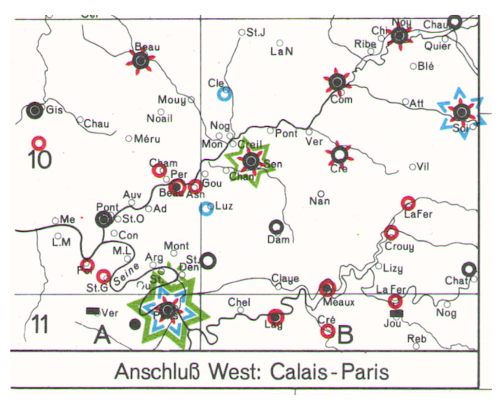
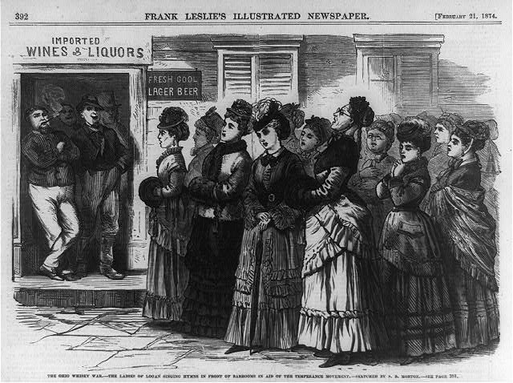

---

## Historical Political Economy

---

### **Conflict Technology as a Catalyst of State Formation**

*with Michael-David Mangini*

<a href="https://www.dropbox.com/scl/fi/hs2quow5zqmx183q3b3ln/walls-draft.pdf?rlkey=ivv8kxkep4sk1iur7w73zq2pb&dl=0" class="button1">DRAFT</a>

We argue that the gunpowder revolution in medieval Europe encouraged the amalgamation of smaller polities into larger centralized states. The shock to military technology made existing fortifications obsolete and dramatically raised the cost of defensive investments. Small polities lacked the fiscal capacity to make these investments, so they had either to ally or merge with others. Alliances created prospects of free-riding by interior cities on border cities. In contrast, unitary centralized states benefited from geographic and fiscal economies of scale, facilitating defensive investments at the border that protected the interior while limiting free-riding and resource misallocation. Using a new dataset on fortifications in over 6,000 European cities, we find that states made defensive investments in areas of territorial contestation, closer to borders, and farther from raw building materials. These findings are consistent with the theory that large centralized states arose in part as a consequence of changes in military technology.

### **The Incentives of Scientific Experts: Evidence from 19th-Century Public Health**

<a href="https://www.dropbox.com/scl/fi/2yaopj74usvx5b7szfr0y/website_cholera_summer_2024.pdf?rlkey=jlt2gity5be8z9mgvplgzjwny&dl=0" class="button1">DRAFT</a>

I examine the dual roles of experts – on one hand, as scholars responsible to a community of their expert peers, and on the other hand, as interested advisors to policymakers – using  evidence from a large corpus of nineteenth-century medical research on cholera. Experts with links to Britain’s overseas trade sector were less likely than experts without such connections to advance theories that cholera was a contagious disease (which had costly implications for British commerce). This difference is driven by the early part of the century, when a scientific consensus around how cholera spreads had not yet solidified. I argue that conflicted experts are more likely to act on their bias in low-information environments, when revealing new information can have a larger impact on policy. As a consensus forms, the value of hiding unfavorable information decreases, and even conflicted experts will reveal what they know to gain scientific credit.

### **Mobilizing the Home Front: The Impact of War on Women's Political Activism**

<a href="https://caseypetroff.github.io/papers/temperance-crusades.pdf" class="button1">DRAFT</a>

The nineteenth century saw the first entry of American women into mass political activity. What spurred this sudden influx of women activists? Leveraging a novel archival data on women's volunteering during the American Civil War across thousands of towns and cities, I link women's wartime home front mobilization to peacetime political activism. Places where women participated in pro-Union volunteering were more likely to have women-led political movements and petition Congress in favor of suffrage after the war. The relationship between wartime volunteering and post-war activism is robust to adjusting for other measures of social and organizational capital, including male enlistment in the Civil War. I argue that wartime volunteer mobilization helped women gain organizing experience. Despite being largely excluded from the public sphere, these women transformed their war experience into lessons for mass politics.

---

## Other Research in Political Economy

### **Export Bans and Volatility Expectations in Grain Markets**

*with Michael K. Adjemian and and Michel A. Robe*

<a href="https://papers.ssrn.com/sol3/papers.cfm?abstract_id=4117628" class="button1">DRAFT</a>

We show the importance of accounting for political risk to understand forward-looking price volatility in agricultural markets. We propose a theoretical model that shows uncertainty about the future world price of staple foods is positively related to the likelihood (and, counterintuitively, is further boosted by the actual imposition) of export bans in top producer countries. To test our model's predictions, we use option-implied volatilities (IVols) as a proxy for commodity market uncertainty. We construct a novel, daily dataset of major restrictions on grain and oilseed exports that were announced, adopted, or repealed in 2002-2019. We show that wheat and corn IVols are significantly higher on the day and the week when a ban is first imposed and also during the whole period when the ban is in effect. The effects of export bans are statistically and economically significant. The results hold even when we control for global macro-economic uncertainty and risk aversion (jointly proxied by the equity VIX) and for cash market tightness (including the state of grain inventories) prior to the ban.

